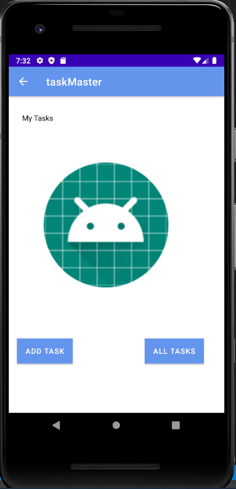
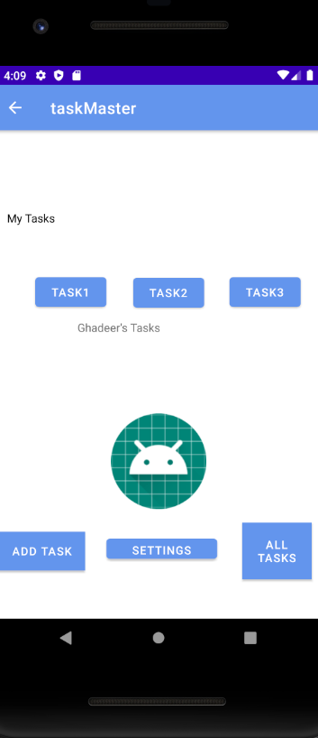
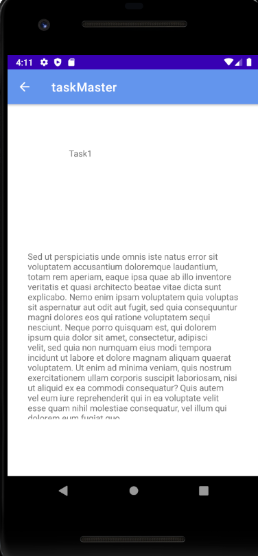
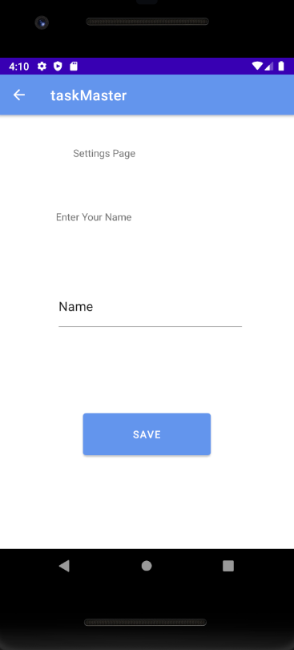
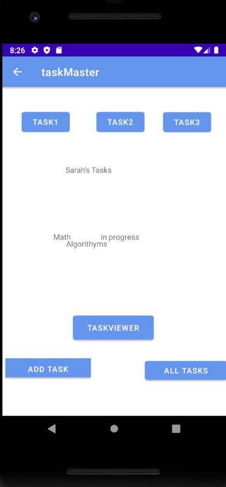
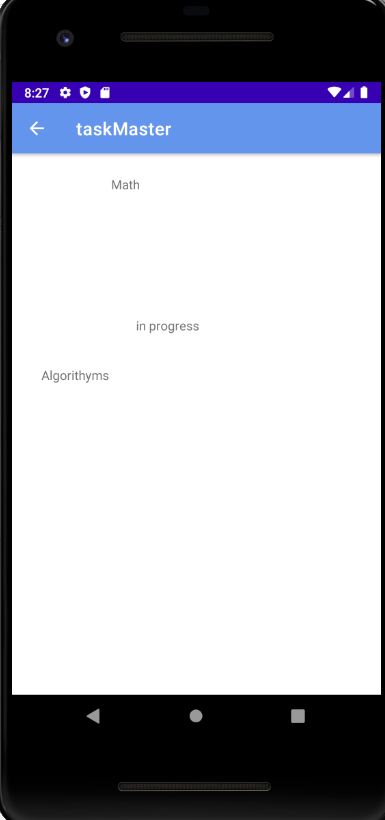
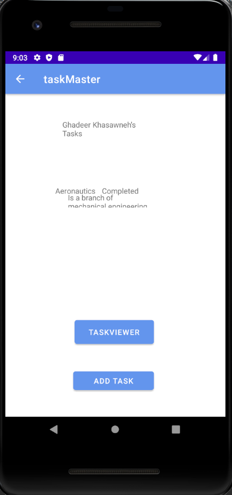
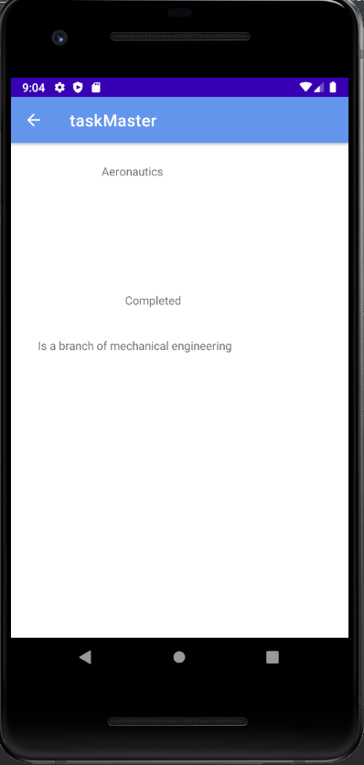
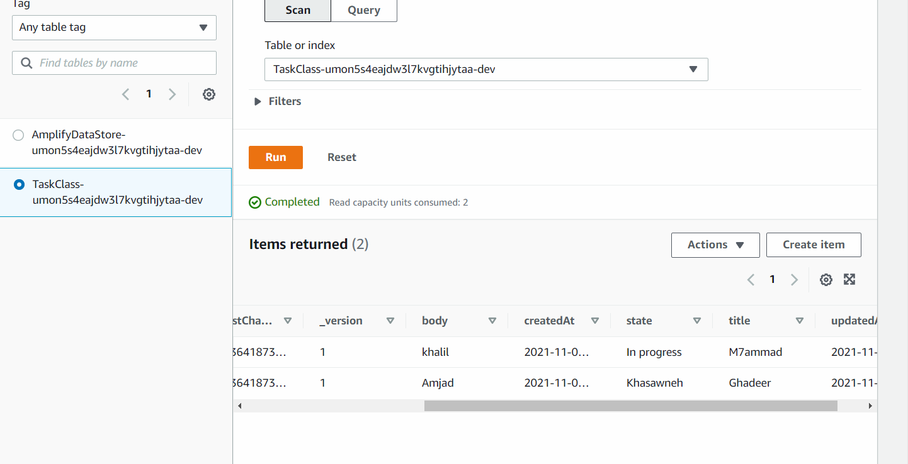

## Lab 26

#### In this lab we created 3 pages, the first page has to buttons and an image, each button takes you to another page, the second page has two fields, and when you type something there, a message will pop up telling you that whay you wrote has been submitted, the third page has an image. The first page

### We used android studio.

# Lab 27

### In this lab we created a home page that have three buttons, each one of them takes you to a page, and that page has the title of the button that was clicked. There's another button that takes you to a settings page where you can enter your name and view it back on the home page.

# Lab 28

### In this lab we added a recycle viewer, added 3 tasks in the home page which are viewed by scrolling, and also you can click on each task and move to another page that has the same title, body and state of the clicked task.

# Lab 29

### In this lab we created database, added data to it by clicking on a button that is on some page, rendered the data on the home page, and when someone clicks on the data, they will be taken into another page that presents this data.PNG

# Lab 31
 ### In this lab we created unit tests for functionalities and completed all labs features.

# Lab 32

### In this lab we used AWS dynamoDB to store our data and get it back, after installing AWS amplify.

